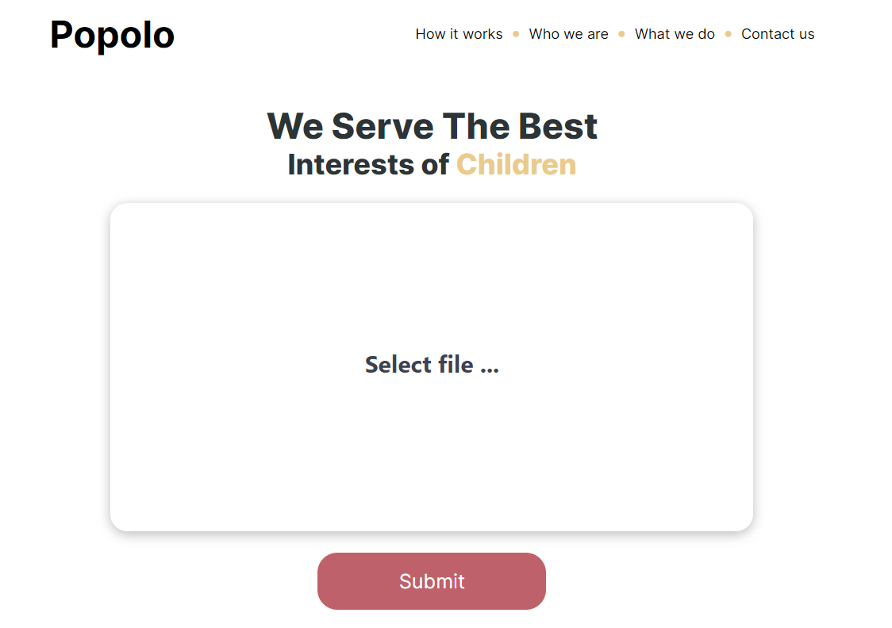

# Computer Vision Camp
## Team: Popolo
Mentor: Stojoc Vladimir

### Table of contents
* [Project description](#description)
* [Implementation](#implementation)
* [Setup](#setup)
* [References](#references)

### Project Description

Seeing as the children are victims of abuse and is are potential witnesses at criminal proceedings, sharing the videos which show the faces of the children subjects the children to potential harm such as victimisation and/or retribution. For this reason, our team developed an application that will blurry the children's faces in videos. 

### Implementation
In order to develop the model for video processing, we combined two neural networks, one for face recognition and the second one, for face classification. As Convolutiona Neural Network for classification, we used the pretrained 101-layered ResNet ```net=resnet101()```, on 10 epochs, that gave us the following results:


The dataset used to train the classificator was composed of two classes: kids and adults, therefore, the train data consisted of 2855 images each class and test length was 826 per each class.

For face recognition, we used OpenCV – DNN method as it is pretty fast and very accurate, even for small sized faces. It also detects faces at various angles and with different light conditions. Actually, DNN detects the face and passes it to the classificator, if the class is greater that 0.5 and less than 1.0, it is a child and this face should be blurred. In order to blur a face, we cut it taking in consideration the coordinates of the face box, we blur it using ```ImageFilter.GuassianBlur()``` and we put back this face. Also, we keep the audio of the video, if it exists using ```MoviePy``` module.



### Installation

1. Clone the repo:

```sh
git clone https://github.com/IuraCPersonal/popolo
```

2. Install and update using pip:

```sh
pip install -r requirements.txt
```

3. To run the application, use the `flask` command or `python -m flask`:

```sh
flask run
```

### References
* https://www.kaggle.com/frabbisw/facial-age
* https://www.mathworks.com/help/deeplearning/ref/resnet18.html
* https://towardsdatascience.com/face-detection-models-which-to-use-and-why-d263e82c302c
* https://www.c-sharpcorner.com/article/detecting-faces-from-image-and-video-using-python/
* https://pytorch.org/docs/stable/index.html
* https://zulko.github.io/moviepy/
